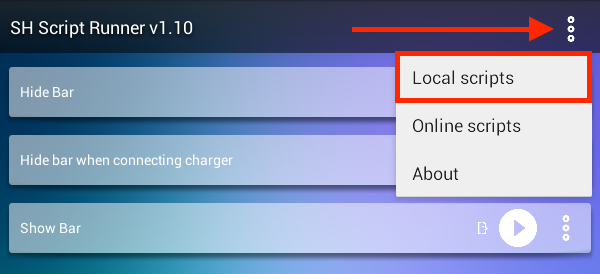
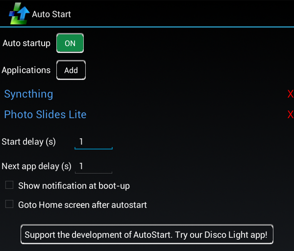

# Android Photo Frame
 This is an atempt to reuse an old Android tablet instead of putting it to trash.

## Requirements
- Android Tablet, in this case Ainol Novo 7 Aurora II
- [Syncthing](https://play.google.com/store/apps/details?id=com.nutomic.syncthingandroid "Syncthing")
- [Photo Slides](https://play.google.com/store/apps/details?id=softick.android.photoframe "Photo Slides")
- [SH Script Runner](https://play.google.com/store/apps/details?id=com.adamioan.scriptrunner "SH Script Runner")
- [Nova Launcher](https://play.google.com/store/apps/details?id=com.teslacoilsw.launcher "Nova Launcher")
- [AutoStart](https://play.google.com/store/apps/details?id=com.autostart "AutoStart")
- [ADB](https://www.xda-developers.com/install-adb-windows-macos-linux/ "ADB")

## Setup
I have used ADB to copy, modify and test. But use what ever method works for you. This guide will not over how to install ADB, see link in requirements.

### Copy some scripts
`adb push *.sh /sdcard/`

### Install some apps
Either download them from Play Store or from some other place and run `adb install *.apk`

### Setup some apps
#### Syncthing
Remeber to setup folder to use Send & Receive, else it wont work.\


#### Photo Slides
Create a shortcut on your desktop/launcher.\
Go through settings for timers, animations etc.\
Select your camera folder (mine was: /sdcard/DCIM/Camera)\
You can also run to add via sqlite.\
First `adb shell`, then:
```
dbpath="/data/data/softick.android.photoframe/databases/PhotoFrameDB"
picdir="/sdcard/DCIM/Camera"
sqlite3 $dbpath "insert into folders(foldID,folder_path,folder_check) values(1,'$picdir',1)"
```
Have included my [Photo Slides config](Configs/softick.android.photoframe_preferences.xml "Photo Slides config") which are located at:\
`/data/data/softick.android.photoframe/shared_prefs/softick.android.photoframe_preferences.xml`\
Install config via adb:
```
adb push softick.android.photoframe_preferences.xml /data/data/softick.android.photoframe/shared_prefs/
```

#### SH Script Runner
Add local scripts Hide Bar, Hide bar when connecting charger and Show Bar.\


Hide Bar setup:\


Hide Bar when connecting charger setup:\


Show Bar setup:\


Final setup with all scripts looks like this:\


Add shortcuts to your desktop for easy access:\


#### Nova Launcher
Set as default, hide some elements. Chose this mainly due to swipe up action for app drawer access. But not a real requirement for the setup.

#### AutoStart
Here is my setup:\


### Get touch coordinates
Run `adb shell getevent -l` and press __CTRL__+__C__ after touching the display\
Look foor POSITION_X and POSITION_Y:
```
...
/dev/input/event4: EV_ABS       ABS_Z                000000d7            
/dev/input/event4: EV_SYN       SYN_REPORT           00000000            
/dev/input/event5: EV_ABS       ABS_MT_POSITION_X    00000142            
/dev/input/event5: EV_ABS       ABS_MT_POSITION_Y    000000b9            
/dev/input/event5: EV_ABS       ABS_MT_TOUCH_MAJOR   000000c8      
...
```
Take that value and convert from HEX to DEC. Example 142 in HEX = 322 DEC.\
Change these values in `framenewpictures.sh` for lines where `input tap`:
```bash
input tap XXX YYY # landscape
input tap XXX YYY # portrait
```

### Crontab
Update crontab.sh according to your preference. Default for update is every 10 minutes and delete log 1th of every month.\
Then run:
```bash
adb shell /sdcard/crontab.sh
```

### Test
Add some pictures, restart and hope for the best.

### Add new pictures
Upload pictures via Syncthing and add/edit textfile refresh.txt to contain the word `yes`. The script `framenewpictures.sh` should then notice that refresh.txt is yes, reload your pictures in to the database and restart Photo Slides app. Once done also change content of refresh.txt to `no`.

## Improvments
Some stuff that could be improved or added:
- Check screen orientation instead of sending two taps
```bash
dumpsys | grep 'SurfaceOrientation' | awk '{ print $2 }'
```

- Fancier update check
Instead of using refresh.txt you could fetch a value from web or other. But works and is simple.

- OpenVPN
Install openvpn client for why not? Add remove support?

- Updater
Have a script run from syncthing folder to run remote updates.

## Other
### hide/show system bar
Thank you [masashi-k](https://masashi-k.blogspot.com/2013/09/hide-show-system-bar-of-android.html "masashi-k blog") for your info.\
Created two simple shell scripts to hide system bar (navigation and notifications) as the app did not do that.\
Add them to SH Script Runner with automations

### Format storage
Had to fix internal storage after a restore.
```bash
fdisk /dev/block/avnftli
d 1
o
w
n
p
1
w
mkfs.exfat /dev/block/avnftli1
```
